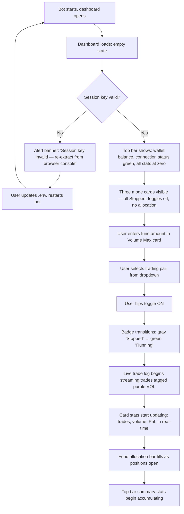
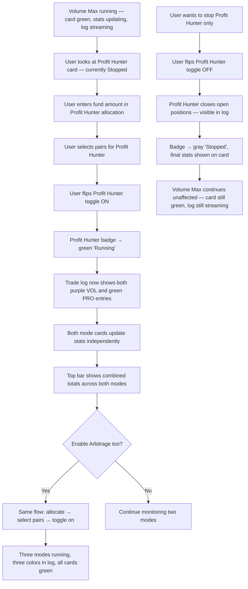
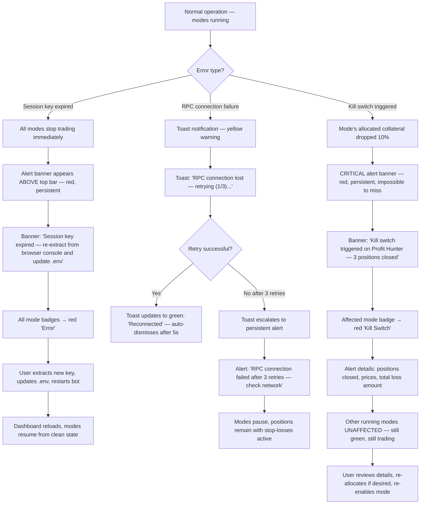
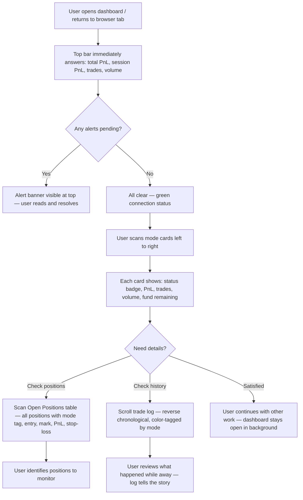

# UX Design Specification ValBot

**Author:** theRoad
**Date:** 2026-04-03

---

<!-- UX design content will be appended sequentially through collaborative workflow steps -->

## Executive Summary

### Project Vision

ValBot is a personal multi-mode trading bot for Valiant Perps on FOGOChain that consolidates three trading strategies — Volume Max (delta-neutral cycling for Flames rewards), Profit Hunter (Pyth oracle-based mean reversion), and Arbitrage (cross-market price exploitation) — into a single tool with a real-time web dashboard. Built for a single technically proficient user, it replaces repetitive manual trade execution with automated, safety-first parallel strategy execution.

### Target Users

Single user (theRoad) — a technically proficient crypto trader familiar with leveraged perpetual futures, delta-neutral strategies, and blockchain tooling. Comfortable with browser console extraction for session keys and `.env` configuration. Needs real-time visibility and full control over multiple concurrent strategies, not hand-holding or onboarding flows.

### Key Design Challenges

1. **Information density management** — The dashboard must surface per-mode stats, combined stats, open positions, trade history, live trade log, fund allocation, and mode controls on a single screen without cognitive overload
2. **Multi-mode parallel state clarity** — Three modes can run independently in any combination; their individual states (active/stopped, healthy/error, fund usage) must be instantly legible at a glance
3. **Critical event communication** — Kill-switch triggers, session key expiry, and RPC failures require immediate visibility with actionable resolution steps, distinct from routine trade activity

### Design Opportunities

1. **Mode-as-card paradigm** — Each trading mode as a self-contained card with its own status indicator, stats, controls, and fund allocation creates an intuitive mental model for parallel operation
2. **Progressive disclosure** — Aggregate summary stats at the top level with drill-down into per-mode details and trade history, keeping the default view clean and scannable
3. **Real-time confidence building** — Live WebSocket-driven trade streaming and status updates create transparency and trust that the bot is operating correctly

## Core User Experience

### Defining Experience

The core experience of ValBot is the **monitor-and-adjust loop**: glancing at the dashboard to confirm modes are running correctly, checking PnL, watching live trades flow, and adjusting strategy allocation as market conditions change. The defining interaction is the dashboard's "at a glance" state — instantly answering whether modes are healthy, capital is safe, and strategies are profitable. When this works, everything else is secondary.

### Platform Strategy

- **Platform:** Localhost web application (browser-based dashboard)
- **Input:** Mouse and keyboard primary; no touch optimization needed
- **Access:** Single user, localhost only — no authentication UI, no remote access
- **Offline:** Not applicable — the bot requires live blockchain connectivity
- **Architecture:** Single-page dashboard, no routing or multi-page navigation; all information and controls visible on one screen

### Effortless Interactions

- **Mode toggling** is a single-click action — no confirmation dialogs, no multi-step flows
- **Fund allocation** is inline within each mode card — no separate settings page
- **Dashboard default view** shows everything needed without scrolling or drilling into sub-views
- **Errors self-surface** — critical events push to the user's attention immediately; the user never has to hunt for problems
- **Pair selection and slippage configuration** happen in-context where the mode is displayed

### Critical Success Moments

1. **"It's alive"** — Toggling a mode on and seeing trades stream into the live log within seconds; the bot feels responsive and real
2. **"It's working for me"** — Glancing at the dashboard and seeing positive PnL accumulating across modes without intervention
3. **"It caught that"** — A kill switch triggers, positions close, and the dashboard shows exactly what happened, why, and what to do — trust earned through transparency
4. **"I'm in control"** — Enabling a third mode alongside two already running, with zero disruption to existing activity

### Experience Principles

1. **Glanceable truth** — The dashboard's default state answers "is everything OK?" in under 2 seconds of looking
2. **Mode independence** — Every mode is a self-contained universe; starting, stopping, or errors in one never affects another visually or functionally
3. **Safety is visible** — Stop-losses, kill switches, and fund boundaries are always displayed, never hidden; confidence comes from seeing the guardrails
4. **Zero-ceremony control** — Every action (toggle, allocate, configure) happens inline with minimal clicks; no modals, wizards, or multi-step flows

## Desired Emotional Response

### Primary Emotional Goals

1. **Confidence** — "My money is safe, the bot is doing exactly what I told it to do." Every element of the dashboard reinforces that the system is operating correctly and capital is protected.
2. **Control** — "I can see everything and change anything instantly." Full visibility into all operations with immediate, responsive controls.
3. **Calm efficiency** — "It's handling the tedious work so I don't have to." The bot absorbs repetitive execution, freeing the user to focus on strategy decisions.

### Emotional Journey Mapping

| Moment | Desired Feeling | Design Implication |
|---|---|---|
| First launch | Competence — "that was easy, it just works" | Zero-friction setup; dashboard loads with clear empty state showing what to do first |
| Modes running | Calm confidence — "everything is green, trades are flowing" | Live trade stream + green status indicators provide continuous reassurance |
| Checking PnL | Honest clarity — numbers presented plainly, good or bad | No gamification or misleading presentation; raw numbers with context |
| Something breaks | Alert but not panicked — "I see the problem, I know the fix" | Errors surface with severity, detail, and actionable resolution steps |
| Kill switch triggers | Trust — "the safety net caught it" | Full transparency: which positions closed, at what prices, total impact |
| Returning after absence | Quick reassurance — "5 seconds to know what happened" | Session summary with key events, PnL delta, and any actions needed |

### Micro-Emotions

- **Confidence over confusion** — Every number, status indicator, and control is self-explanatory; no jargon without context, no ambiguous states
- **Trust over skepticism** — Live WebSocket data streaming proves the bot is active; safety mechanisms (stop-loss, kill switch, fund boundaries) are always visible, not hidden behind settings
- **Accomplishment over frustration** — Watching volume and PnL accumulate in real-time reinforces that the tool is working; progress feels tangible

### Design Implications

- **Confidence** → Consistent, predictable UI behavior; status indicators that are always accurate; no stale data
- **Control** → Inline controls with immediate feedback; no loading spinners that leave you wondering if the action took effect
- **Calm** → Muted, professional color palette; no flashing alerts for routine events; visual hierarchy that separates normal operation from exceptional events
- **Trust** → Transparent safety state: stop-loss status shown per position, kill-switch thresholds visible per mode, fund allocation boundaries always displayed

### Emotional Design Principles

1. **Reassurance through transparency** — Show the system's state honestly and completely; hiding complexity erodes trust when real money is at stake
2. **Proportional urgency** — Routine trades get subtle log entries; errors get prominent alerts; kill-switch events get impossible-to-miss notifications. Match visual intensity to actual severity.
3. **Competence, not hand-holding** — The UI assumes a knowledgeable user; no tutorials, tooltips on obvious controls, or "are you sure?" dialogs. Respect the user's expertise.
4. **Honest numbers** — PnL, fees, volumes, and fund usage are presented plainly without spin. Losses are shown as clearly as gains.

## UX Pattern Analysis & Inspiration

### Inspiring Products Analysis

**Grafana — Monitoring Dashboards**
- **Core strength:** Information-dense single-screen views with clear visual hierarchy and real-time streaming data
- **UX excellence:** Panel-based layout where each panel is a self-contained data unit; color-coded severity system (green/yellow/red) that communicates state instantly; live-updating metrics without page refresh
- **Relevance to ValBot:** Direct model for the dashboard's overall layout philosophy — multiple data panels on one screen, each updating independently in real-time

**TradingView — Trading Interface**
- **Core strength:** Professional presentation of financial data with clean number formatting, intuitive PnL coloring, and a dark-theme aesthetic suited for extended sessions
- **UX excellence:** Green/red PnL presentation is immediately legible; position and order tables are scannable; real-time price updates feel fluid, not jarring
- **Relevance to ValBot:** Model for how to present financial numbers (PnL, volumes, fees), trade history tables, and position cards with professional clarity

**Portainer — Container Management**
- **Core strength:** Managing multiple independent running processes from a single dashboard with inline start/stop controls and per-process status
- **UX excellence:** Each container is a card with status badge (running/stopped/error), inline action buttons, and resource stats — the "card per running thing" pattern
- **Relevance to ValBot:** Direct analog for mode management — each trading mode maps to a "container" with its own status, controls, and resource (fund) allocation

### Transferable UX Patterns

**Layout Patterns:**
- **Panel/card grid** (Grafana) — Each mode as a self-contained card with status, stats, and controls; combined summary stats in a top bar
- **Single-screen density** (Grafana) — All critical information visible without scrolling; progressive disclosure for history and logs

**Interaction Patterns:**
- **Inline toggle controls** (Portainer) — Start/stop modes directly on the card, no navigation to a separate page
- **Live-streaming log** (Grafana) — Trade log streams in real-time at the bottom of the screen, auto-scrolling with pause-on-hover

**Data Presentation Patterns:**
- **Green/red PnL** (TradingView) — Universally understood; positive values green, negative red, zero neutral
- **Status badges** (Portainer) — Small colored badges on each mode card: green=running, gray=stopped, red=error
- **Monospace numbers** (TradingView) — Financial figures in monospace font so columns align and digits don't shift as values change

### Anti-Patterns to Avoid

1. **Over-configurable dashboards** (Grafana pitfall) — ValBot has a fixed purpose; don't add panel customization, drag-and-drop layout, or user-configurable widgets. One layout that works.
2. **Multi-tab/multi-page navigation** (TradingView pitfall) — Everything on one screen. No tabs for "positions," "history," "settings" as separate pages. Inline or sectioned on the single view.
3. **Stale data indicators** (common monitoring pitfall) — Never show a timestamp like "last updated 30s ago." If WebSocket is connected, data is live. If disconnected, show a clear disconnection alert — not a stale timer.
4. **Confirmation dialogs on routine actions** — Don't ask "are you sure?" for toggling a mode on/off. These are frequent, intentional actions by an expert user.
5. **Information overload without hierarchy** — Avoid flat layouts where every metric has equal visual weight. Use size, color, and position to create clear hierarchy: status first, PnL second, details third.

### Design Inspiration Strategy

**Adopt:**
- Grafana's panel/card grid layout for mode cards and summary stats
- Portainer's inline toggle + status badge pattern for mode controls
- TradingView's financial number formatting and green/red PnL convention
- Real-time streaming log at the bottom of the viewport

**Adapt:**
- Grafana's alert severity system → simplified to three levels: normal (green), warning (yellow), critical (red)
- Portainer's container detail expansion → mode cards expand inline to show pair selection, slippage config, and detailed stats
- TradingView's trade history table → simplified columns relevant to ValBot (time, mode, pair, side, size, price, PnL, fees)

**Avoid:**
- Dashboard customization or layout configuration
- Multi-page navigation or tab-based information architecture
- Stale-data timestamps instead of live connection status
- Confirmation dialogs on routine mode toggle actions

## Design System Foundation

### Design System Choice

**Tailwind CSS + shadcn/ui** — A utility-first CSS framework paired with copy-paste React components that provide full ownership and customization without framework lock-in.

### Rationale for Selection

1. **Speed-to-value** — shadcn/ui provides pre-built components (cards, tables, badges, toggles, alerts) that map directly to ValBot's dashboard needs, minimizing custom component development
2. **Dark theme native** — First-class dark mode support in both Tailwind and shadcn/ui; the professional trading dashboard aesthetic requires minimal configuration
3. **Full ownership** — Components are copied into the project source, not imported from node_modules; any component can be modified without forking a library or fighting framework opinions
4. **Lightweight runtime** — No heavy UI framework overhead; critical for a real-time WebSocket-driven dashboard where frequent DOM updates must remain performant
5. **Solo developer fit** — Low learning curve, excellent documentation, and a single utility-class approach reduces context-switching between CSS files and component logic
6. **Financial data presentation** — Tailwind's `font-mono` utility and shadcn/ui's table components make aligned, professional number formatting trivial

### Implementation Approach

- **Base:** Tailwind CSS for all styling via utility classes; no separate CSS files
- **Components:** shadcn/ui components installed into project source (`components/ui/`) — cherry-pick only what's needed
- **Key components to install:** Card, Table, Badge, Switch, Alert, Sheet, Separator, ScrollArea
- **Theme:** Dark mode as default (not toggle); custom color tokens for trading-specific semantics (profit green, loss red, warning amber, neutral gray)
- **Typography:** System font stack for UI text; monospace for all financial numbers and the live trade log
- **Layout:** CSS Grid (Tailwind grid utilities) for the dashboard panel layout; Flexbox for component internals

### Customization Strategy

**Design Tokens (Tailwind config):**
- `--profit`: green for positive PnL and healthy status
- `--loss`: red for negative PnL and error states
- `--warning`: amber for kill-switch thresholds approaching and non-critical alerts
- `--neutral`: muted gray for stopped/inactive states
- `--surface`: dark background tiers for card elevation and visual hierarchy

**Component Customizations:**
- **Card** → Mode cards with integrated status badge, toggle, and inline stats
- **Table** → Trade history and open positions with monospace number columns
- **Badge** → Status indicators (running/stopped/error) with semantic colors
- **Switch** → Mode toggle controls
- **Alert** → Error and kill-switch notifications with severity-based styling
- **ScrollArea** → Live trade log with auto-scroll behavior

## Defining Core Experience

### Defining Experience

**"Toggle a strategy on and watch it trade for you in real-time."**

The defining interaction of ValBot is the moment the user activates a trading mode and sees it begin executing autonomously. The user flips a switch, allocates a budget, and within seconds the live trade log streams trades tagged with that mode. This is the core loop that replaces manual trade execution — the bot runs the playbook while the user watches and adjusts.

### User Mental Model

- **Current approach:** Manually executing trades on Valiant Perps — opening positions, monitoring prices, closing at targets, repeating across multiple strategies
- **Mental model:** "I have three trading playbooks. I want to hand each one to an autonomous worker, give it a budget, and watch it execute while I maintain oversight."
- **UX mapping:** Each mode card = one worker with its own assignment, budget, status, and performance stats. The dashboard = a control room overseeing all workers simultaneously.
- **Expectation:** Toggle on → it trades. Toggle off → it stops and cleans up. No hidden state, no ambiguity.

### Success Criteria

1. **Immediate responsiveness** — Toggle on a mode → trades appear in the live log within seconds; zero perceptible delay between activation and first trade
2. **Visible autonomy** — PnL, trade count, and volume update in real-time on the mode card; the bot feels alive, not like a black box
3. **Budget discipline** — Fund allocation is visibly respected; the remaining balance updates as positions open; a mode never exceeds its allocation
4. **Clean shutdown** — Toggle off a mode → open positions close, final stats display, status returns to stopped; no orphaned positions, no ambiguous state

### Novel UX Patterns

ValBot uses **entirely established UX patterns** combined effectively — no novel interactions requiring user education:

- **Toggle switch** — Universal on/off control for mode activation
- **Card layout** — Standard dashboard pattern for self-contained information units
- **Live streaming log** — Terminal/console pattern familiar to technical users and traders
- **Status badges** — Universal running/stopped/error indicators with color coding
- **Inline number inputs** — Standard form pattern for fund allocation

The innovation is in what the bot automates, not in how the interface works. This means zero learning curve for the UI itself.

### Experience Mechanics

**1. Initiation:**
The user opens the dashboard and sees three mode cards in a horizontal row. Each card displays: mode name, status badge (gray "Stopped"), fund allocation input (empty or last-used value), pair selector, and a toggle switch (off). The cards invite action through their clear empty state.

**2. Interaction:**
The user enters a fund amount in a mode card's allocation field and flips the toggle switch. Two actions total — allocate and activate. No wizard, no confirmation dialog, no separate configuration page.

**3. Feedback:**
- Status badge transitions to green "Running"
- Live trade log at the bottom begins streaming trades tagged with the mode's color and name
- Card stats (trades executed, volume generated, session PnL) begin updating in real-time
- Fund allocation shows remaining balance updating as positions open and close

**4. Completion:**
The user flips the toggle off. The mode initiates shutdown:
- Open positions close (visible in the trade log as closing trades)
- Status badge transitions to gray "Stopped"
- Card displays final session stats (total trades, volume, net PnL)
- The shutdown is visible, orderly, and complete — no ambiguous intermediate states

## Visual Design Foundation

### Color System

**Base Palette (Dark Theme):**
- **Background (base):** `#0a0a0f` — Near-black with a slight blue undertone; avoids pure black which causes eye strain during extended sessions
- **Background (surface):** `#12121a` — Elevated card backgrounds; subtle lift from base
- **Background (elevated):** `#1a1a26` — Hover states, active cards, secondary surfaces
- **Border:** `#2a2a3a` — Subtle separation between elements; visible but not competing for attention

**Semantic Colors:**
- **Profit/Success:** `#22c55e` (Tailwind green-500) — Positive PnL, running status, healthy state
- **Loss/Error:** `#ef4444` (Tailwind red-500) �� Negative PnL, error status, kill-switch triggered
- **Warning:** `#f59e0b` (Tailwind amber-500) — Kill-switch threshold approaching, session key expiring soon, non-critical alerts
- **Neutral/Inactive:** `#6b7280` (Tailwind gray-500) — Stopped modes, zero values, disabled controls
- **Accent:** `#3b82f6` (Tailwind blue-500) — Interactive elements (toggles, inputs, links), focus rings, active selections

**Text Colors:**
- **Primary text:** `#f1f5f9` (Tailwind slate-100) — Headlines, mode names, key stats
- **Secondary text:** `#94a3b8` (Tailwind slate-400) — Labels, timestamps, supporting info
- **Muted text:** `#64748b` (Tailwind slate-500) — Tertiary info, disabled labels

**Mode Identity Colors** (for trade log tagging and card accents):
- **Volume Max:** `#8b5cf6` (purple) �� Distinct, suggests volume/scale
- **Profit Hunter:** `#22c55e` (green) — Naturally maps to profit-seeking
- **Arbitrage:** `#06b6d4` (cyan) — Technical, suggests speed/precision

### Typography System

**Font Stack:**
- **UI text:** `Inter, system-ui, -apple-system, sans-serif` — Clean, highly legible at small sizes, excellent for dense dashboards. Available via Google Fonts or system fallback.
- **Financial numbers:** `JetBrains Mono, ui-monospace, monospace` — Tabular figures by default, digits don't shift as values change, professional terminal aesthetic for the trade log

**Type Scale (Tailwind classes):**
| Element | Size | Weight | Font |
|---|---|---|---|
| Dashboard title | `text-xl` (20px) | `font-semibold` (600) | Inter |
| Mode card title | `text-lg` (18px) | `font-semibold` (600) | Inter |
| Stat label | `text-xs` (12px) | `font-medium` (500) | Inter |
| Stat value | `text-2xl` (24px) | `font-bold` (700) | JetBrains Mono |
| Table header | `text-xs` (12px) | `font-medium` (500) | Inter |
| Table cell (text) | `text-sm` (14px) | `font-normal` (400) | Inter |
| Table cell (number) | `text-sm` (14px) | `font-normal` (400) | JetBrains Mono |
| Trade log entry | `text-xs` (12px) | `font-normal` (400) | JetBrains Mono |
| Badge text | `text-xs` (12px) | `font-medium` (500) | Inter |

### Spacing & Layout Foundation

**Spacing Scale:** 4px base unit (Tailwind default)
- `gap-1` (4px) — Tight spacing within badges, between icon and label
- `gap-2` (8px) — Spacing between stat label and value, within card sections
- `gap-3` (12px) — Spacing between card sections
- `gap-4` (16px) — Card internal padding, spacing between cards in grid
- `gap-6` (24px) — Section spacing on the dashboard

**Layout Structure:**
- **Overall:** Single viewport, no scroll on default view. CSS Grid with defined regions.
- **Top bar:** Full width — wallet balance, total PnL, total trades, total volume, bot connection status. Fixed height.
- **Mode cards row:** Three equal-width cards in a horizontal row (`grid-cols-3`). Each card contains: header (name + badge + toggle), stats grid, fund allocation, pair selector.
- **Bottom section:** Split into two panels side by side — Open Positions table (left, ~60% width) and Live Trade Log (right, ~40% width). Both fill remaining viewport height.
- **Alerts:** Toast-style notifications that stack from the top-right corner. Critical alerts (kill switch) use a persistent banner above the top bar.

**Density Philosophy:** Dense but not cramped. Every pixel earns its place. Generous padding inside cards (16px), tight spacing between data points within a card. The dashboard should feel like a professional control room — information-rich but organized.

### Accessibility Considerations

- **Contrast ratios:** All text colors meet WCAG AA minimum (4.5:1 for normal text, 3:1 for large text) against dark backgrounds
- **Color is not the only indicator:** PnL values show +/- prefix in addition to green/red coloring; status badges include text labels ("Running"/"Stopped"/"Error") alongside color
- **Focus indicators:** Blue focus rings (`ring-2 ring-blue-500`) on all interactive elements for keyboard navigation
- **Font sizes:** Minimum 12px for any readable text; stat values at 24px for quick scanning
- **Monospace alignment:** Tabular figures ensure numbers are scannable in columns without visual jitter

## Design Direction Decision

### Design Directions Explored

Six design directions were generated and evaluated via interactive HTML mockups (`ux-design-directions.html`):

1. **A: Classic Grid** — Top summary bar, three mode cards in a row, positions table and trade log below
2. **B: Compact** — Tighter spacing and smaller type for maximum data density
3. **C: Wide Cards** — Full-width horizontal mode cards in a scrollable vertical layout
4. **D: Terminal** — Fully monospace, key-value pair aesthetic with sharp corners
5. **E: Sidebar** — Mode controls in a left sidebar, data in the main content area
6. **F: Minimal** — Spacious layout with PnL as hero metric and rounder corners

### Chosen Direction

**Direction A: Classic Grid**

The Grafana-inspired layout with three distinct zones:
1. **Top bar** — Full-width summary stats (wallet, total PnL, session PnL, trades, volume) + connection status
2. **Mode cards row** — Three equal-width cards (`grid-cols-3`), each with: name + status badge, toggle, 2x2 stats grid, fund allocation bar with remaining balance
3. **Bottom split** — Open Positions table (~60% width) and Live Trade Log (~40% width), filling remaining viewport height

### Design Rationale

- **Matches the "glanceable truth" principle** — Eyes scan top-to-bottom: summary → modes → details. Status answers are found in under 2 seconds.
- **Directly implements mode-as-card paradigm** — Each mode is a self-contained card with its own status, stats, toggle, and fund allocation, exactly as established in the core experience definition.
- **Proven pattern from Grafana and Portainer** — No novel layout requiring user learning; the grid panel approach is familiar to technical users and monitoring tools.
- **Optimal for single-viewport, no-scroll** — The three-zone grid (top bar, cards, bottom panels) fills the viewport precisely without overflow or dead space.
- **Supports all PRD requirements in one view** — Mode toggling (FR26), fund allocation (FR9-11), open positions (FR14), trade log (FR24), per-mode stats (FR22), combined stats (FR23), and bot status (FR18) are all visible simultaneously.

### Implementation Approach

- **CSS Grid** for the three-zone layout: `grid-template-rows: auto auto 1fr`
- **Mode cards** as shadcn/ui Card components with custom header (name + Badge + Switch), stats grid, and fund allocation progress bar
- **Top bar** as a single Card with horizontal flex layout for summary stat groups
- **Bottom panels** as two Cards in a `grid-template-columns: 3fr 2fr` grid, each containing a ScrollArea
- **Positions panel** uses shadcn/ui Table component with monospace number columns
- **Trade log panel** uses ScrollArea with auto-scroll and monospace log entries color-tagged by mode
- **Alert banner** renders above the top bar for critical events (kill switch); toast notifications from top-right for non-critical alerts

## User Journey Flows

### Journey 1: First Launch — "Get Trading in Minutes"

**Entry point:** User runs the bot after configuring `.env` with extracted session key. Dashboard opens in browser.

**Flow:**

**Key UX decisions:**
- Empty state is not blank — cards are visible with clear inputs, inviting first action
- No wizard or setup flow — the dashboard IS the setup
- Pair selector defaults to most popular pair (SOL-PERP) to reduce first-action friction
- First trade appears in the log within seconds of toggle, delivering immediate "it's alive" feedback

### Journey 2: Multi-Mode Operation — "Stack the Strategies"

**Entry point:** User has Volume Max running, wants to enable additional modes.

**Flow:**

**Key UX decisions:**
- Enabling a new mode requires zero interaction with running modes — complete independence
- Trade log color-coding makes multi-mode activity instantly parseable
- Top bar always shows combined totals; individual cards show per-mode stats
- Stopping one mode triggers visible position closing in the log before badge changes to Stopped

### Journey 3: Error & Kill Switch — "Clear Alerts, Clear Actions"

**Entry point:** An error occurs during normal operation.

**Flow:**

**Key UX decisions:**
- Three severity levels map to three visual treatments: toast (yellow/warning), alert banner (red/critical), with proportional urgency
- Kill switch alerts show full transparency: which positions, at what prices, how much lost
- Other modes are visually unaffected when one mode errors — reinforces mode independence
- Every error includes the resolution path — never a dead end

### Journey 4: Monitoring Performance — "How Am I Doing?"

**Entry point:** User returns to the dashboard after time away.

**Flow:**

**Key UX decisions:**
- The "5 second reassurance" — top bar + mode cards answer everything without any interaction
- No "session summary" overlay or popup on return — the dashboard IS the summary
- Trade log serves as the audit trail for what happened during absence
- WebSocket reconnects silently on tab focus — data is current within 1 second of returning

### Journey Patterns

**Entry Pattern: Zero-Ceremony Start**
Every journey begins with the user already looking at the dashboard. There is no login, no loading screen, no onboarding modal. The dashboard is always in a readable state — even if all modes are stopped, the empty state shows cards with clear input fields.

**Action Pattern: Allocate → Configure → Toggle**
All mode activation follows the same three-step pattern regardless of which mode: enter fund amount, select pairs, flip toggle. Consistent muscle memory across all three modes.

**Feedback Pattern: Immediate Visual Confirmation**
Every user action produces visible feedback within 1 second:
- Toggle on → badge turns green + first trade appears in log
- Toggle off → closing trades appear in log + badge turns gray
- Error occurs → alert/toast appears immediately with details

**Error Pattern: Severity-Based Escalation**
- **Info** (auto-dismiss toast): Reconnection success, trade confirmations
- **Warning** (persistent toast): RPC retry in progress, approaching kill-switch threshold
- **Critical** (banner above top bar): Session expired, kill switch triggered, RPC failed after retries

**Independence Pattern: Mode Isolation**
Every journey preserves mode independence. Starting, stopping, or erroring in one mode never affects the visual state or operation of other modes. This is reinforced visually by each card being a self-contained unit.

### Flow Optimization Principles

1. **Minimize steps to first trade** — From dashboard open to first trade streaming: enter amount → select pair → toggle on. Three actions, under 10 seconds.
2. **No modal interruptions** — All actions happen inline on the dashboard. No confirmation dialogs, settings pages, or multi-step wizards break the single-screen flow.
3. **Errors self-surface with resolution** — The user never discovers a problem by noticing something isn't working. Errors push to the user's attention immediately with the exact next step.
4. **Consistent patterns reduce cognitive load** — All three modes use identical interaction patterns. Learn one, know all three.
5. **The dashboard is always the answer** — Whether first launch, returning after hours, or handling an error, the dashboard itself is the complete interface. No navigation, no sub-pages, no hidden state.

## Component Strategy

### Design System Components

**shadcn/ui primitives used directly:**

| Component | Usage in ValBot | Customization |
|---|---|---|
| **Card** | Mode cards, summary bar, bottom panels | Dark theme tokens, custom border colors per mode |
| **Table** | Open positions, trade history | Monospace number columns, PnL color classes |
| **Badge** | Mode status indicators | Custom variants: running (green), stopped (gray), error (red), kill-switch (red pulse) |
| **Switch** | Mode toggle on/off | Blue accent when on, gray when off |
| **Alert** | Toast notifications | Three severity variants: info (auto-dismiss), warning (persistent), critical (persistent + banner) |
| **ScrollArea** | Trade log, positions overflow | Auto-scroll with pause-on-hover behavior |
| **Input** | Fund allocation amount | Monospace, right-aligned, numeric-only |
| **Select** | Trading pair selector, slippage config | Dark theme dropdown, multi-select for pairs |
| **Separator** | Section dividers within cards | Subtle border color |

**No gaps in primitive coverage** — all custom components are compositions of these existing primitives.

### Custom Components

#### ModeCard

**Purpose:** Self-contained control and monitoring unit for a single trading mode. The primary interactive element of the dashboard.

**Anatomy:**
1. **Header row:** Mode name (colored by mode identity) + Status Badge + Toggle Switch
2. **Stats grid:** 2x2 grid showing PnL, Trades, Volume, Allocated — all monospace
3. **Fund allocation bar:** Progress bar showing remaining/total with label
4. **Pair selector:** Inline dropdown for trading pair selection
5. **Slippage display:** Current slippage value (editable inline)

**States:**
- **Stopped:** Gray badge, toggle off, stats show last session or zero, muted text, pair selector enabled
- **Running:** Green badge, toggle on, stats updating in real-time, fund bar animating, pair selector disabled (can't change pairs while running)
- **Error:** Red badge with error label, toggle forced off, last known stats preserved, error detail text below stats
- **Kill Switch:** Red badge with "Kill Switch" label, toggle forced off, card shows kill-switch details (positions closed, prices, loss)
- **Starting:** Green badge with "Starting..." label, toggle on, brief transitional state before first trade

**Props:**
- `mode`: "volume-max" | "profit-hunter" | "arbitrage"
- `status`: "stopped" | "running" | "error" | "kill-switch" | "starting"
- `stats`: { pnl, trades, volume, allocated, remaining }
- `pairs`: string[] (selected pairs)
- `availablePairs`: string[] (all selectable pairs)
- `slippage`: number
- `onToggle`: () => void
- `onAllocate`: (amount: number) => void
- `onPairsChange`: (pairs: string[]) => void

**Accessibility:**
- Toggle switch has `aria-label`: "Toggle {mode name} mode"
- Stats values have `aria-live="polite"` for screen reader updates
- Fund input has `aria-label`: "Fund allocation for {mode name}"

---

#### SummaryBar

**Purpose:** Top-level dashboard summary showing aggregate stats and system health at a glance. First thing the eye hits.

**Anatomy:**
1. **Left section:** ValBot logo/name + Connection status indicator (dot + label)
2. **Right section:** Horizontal stat groups — Wallet Balance, Total PnL, Session PnL, Total Trades, Total Volume

**States:**
- **Connected:** Green dot + "Connected" label
- **Reconnecting:** Yellow dot (pulsing) + "Reconnecting..." label
- **Disconnected:** Red dot + "Disconnected" label

**Props:**
- `connectionStatus`: "connected" | "reconnecting" | "disconnected"
- `stats`: { wallet, totalPnl, sessionPnl, totalTrades, totalVolume }

**Accessibility:**
- Connection status has `aria-live="assertive"` for immediate screen reader announcement on change
- Stat values use `aria-label` with full context: "Total profit and loss: plus $1,247.83"

---

#### TradeLog

**Purpose:** Real-time streaming log of all trade activity, color-tagged by mode. The "heartbeat" of the dashboard that proves the bot is alive.

**Anatomy:**
1. **Header:** "Live Trade Log" title
2. **Log body:** ScrollArea containing chronological log entries (newest at top)
3. **Log entry:** Timestamp + Mode tag (colored) + Action + Details

**Entry format:** `{HH:mm:ss} [{MODE}] {action} {side} {pair} {details}`

**Behavior:**
- Auto-scrolls to newest entry when new trades arrive
- Pauses auto-scroll when user hovers or manually scrolls up
- Resumes auto-scroll when user scrolls back to bottom or moves mouse away
- Maximum 500 entries retained in DOM; older entries garbage collected

**States:**
- **Streaming:** Entries flowing in, scroll indicator at bottom
- **Paused:** User scrolled up, subtle "New trades below ↓" indicator at bottom
- **Empty:** "Waiting for trades..." placeholder text

**Props:**
- `entries`: TradeLogEntry[] (streamed via WebSocket)
- `maxEntries`: number (default 500)

---

#### PositionsTable

**Purpose:** Live-updating table of all currently open positions across all modes.

**Anatomy:**
| Column | Type | Notes |
|---|---|---|
| Mode | Text (colored) | Mode identity color + abbreviated name |
| Pair | Text | e.g., SOL-PERP |
| Side | Text (colored) | Green "Long" / Red "Short" |
| Size | Monospace | Dollar amount |
| Entry | Monospace | Entry price |
| Mark | Monospace | Current mark price (live updating) |
| PnL | Monospace (colored) | Green positive, red negative, gray zero |
| Stop-Loss | Monospace | Stop-loss price |

**States:**
- **Active positions:** Normal display with live-updating Mark and PnL columns
- **Closing:** Row briefly highlights yellow before removal when position closes
- **Empty:** "No open positions" centered placeholder

**Props:**
- `positions`: Position[] (live-updating via WebSocket)

**Accessibility:**
- Table uses proper `<thead>` and `<tbody>` structure
- PnL values include +/- prefix for non-visual differentiation
- Side column includes text "Long"/"Short" not just color

---

#### AlertBanner

**Purpose:** Persistent critical alert that renders above the entire dashboard for events that demand immediate attention.

**Anatomy:**
1. **Icon:** Warning/error icon (left)
2. **Message:** Primary alert message
3. **Details:** Expandable detail section (for kill-switch: positions closed, prices, loss amount)
4. **Action:** Resolution instruction or dismiss button

**States:**
- **Critical (red):** Session expired, kill switch triggered — cannot be dismissed until resolved
- **Warning (amber):** RPC failure after retries — can be dismissed but re-appears if unresolved

**Props:**
- `severity`: "critical" | "warning"
- `message`: string
- `details`: string | ReactNode (optional, expandable)
- `action`: string (resolution instruction)
- `dismissable`: boolean

---

#### FundAllocationBar

**Purpose:** Visual progress bar showing how much of a mode's allocated funds are currently in use.

**Anatomy:**
1. **Progress bar:** Thin horizontal bar showing used/total ratio
2. **Label:** "$X,XXX / $X,XXX remaining" text below

**States:**
- **Normal:** Mode identity color fill, percentage based on remaining/allocated
- **Warning (>80% used):** Fill transitions to amber
- **Critical (>90% used):** Fill transitions to red (approaching kill switch)
- **Empty:** Gray, no fill, "Not allocated" label

**Props:**
- `allocated`: number
- `remaining`: number
- `modeColor`: string (CSS color)

### Component Implementation Strategy

**Build order aligned to user journeys:**

All custom components are compositions of shadcn/ui primitives + Tailwind utilities. No external dependencies beyond the design system. Each component:
- Uses design tokens from Tailwind config (semantic colors, spacing, typography)
- Accepts data via props, subscribes to WebSocket updates via React context
- Renders with server-side defaults and hydrates with live data

**Data flow pattern:**
- WebSocket connection managed by a single `useBotConnection` hook
- Hook provides: connection status, mode states, positions, trade log entries, stats
- Components subscribe to relevant slices via React context — no prop drilling
- Optimistic UI for toggle actions: badge changes immediately, reverts if server rejects

### Implementation Roadmap

**Phase 1 — Core (needed for first functional dashboard):**
1. **SummaryBar** — establishes the dashboard frame and connection status
2. **ModeCard** — the primary interaction unit; enables the defining experience
3. **TradeLog** — provides the "it's alive" feedback that proves the bot is working
4. **FundAllocationBar** — embedded in ModeCard; shows budget discipline

**Phase 2 — Monitoring (needed for full operational visibility):**
5. **PositionsTable** — open position tracking with live PnL
6. **AlertBanner** — critical event communication for errors and kill switches

**Phase 3 — Polish:**
7. Toast notification variants (info, warning) for non-critical events
8. Kill-switch detail expansion within ModeCard
9. Trade history view (reuses PositionsTable pattern with closed positions)

## UX Consistency Patterns

### Feedback Patterns

**Real-Time Data Updates:**
- All live-updating values (PnL, trade count, volume, mark prices) update in-place without visual disruption
- No flash, blink, or highlight on routine updates — the numbers simply change
- Exception: when a position closes, the PositionsTable row briefly highlights yellow (200ms fade) before removal to make the change noticeable

**Action Feedback:**
| User Action | Feedback | Timing |
|---|---|---|
| Toggle mode ON | Badge transitions to green "Running" | Immediate (optimistic) |
| Toggle mode OFF | Badge transitions to gray "Stopped" | After positions confirmed closed |
| Change fund allocation | Input value updates, fund bar adjusts | Immediate |
| Change pair selection | Dropdown closes, selected pairs shown | Immediate |
| Change slippage | Value updates inline | Immediate |

**Error Feedback (three-tier system):**

| Tier | Visual Treatment | Behavior | Example |
|---|---|---|---|
| **Info** | Green toast, top-right | Auto-dismisses after 5 seconds | "Reconnected to RPC" |
| **Warning** | Amber toast, top-right | Persistent until dismissed or resolved | "RPC connection lost — retrying (2/3)..." |
| **Critical** | Red banner above top bar | Persistent, cannot be dismissed until resolved | "Session key expired — re-extract from browser console" |

**Toast Stacking:**
- Toasts stack vertically from top-right corner
- Maximum 3 visible toasts; older toasts collapse
- Each toast has: severity icon + message + timestamp + dismiss button (except critical)
- Toasts slide in from right (200ms ease-out), fade out on dismiss (150ms)

**No Feedback Anti-Patterns:**
- Never show "Loading..." spinners for real-time data — data is either live or disconnected
- Never show success toasts for routine actions (toggling a mode doesn't need a "Mode started!" toast — the badge change IS the feedback)
- Never show "Are you sure?" confirmations — all actions are immediately reversible by toggling back

### Control Patterns

**Toggle Switch (Mode Activation):**
- **Visual:** shadcn/ui Switch, blue when on, gray when off
- **Behavior:** Single click toggles state. No double-click, no long-press.
- **Disabled state:** Toggle is disabled (grayed out, no pointer cursor) when: no fund allocation set, or mode is in error/kill-switch state
- **Optimistic update:** Badge changes immediately on toggle; reverts if server rejects within 2 seconds

**Inline Number Input (Fund Allocation):**
- **Visual:** Monospace, right-aligned, `$` prefix outside input, no border until focused
- **Behavior:** Click to edit, type amount, blur or Enter to commit. No stepper arrows.
- **Validation:** Numeric only, minimum $0, maximum = wallet balance minus other allocations. Invalid input reverts to previous value on blur — no error message needed (the constraint is the wallet balance shown in the top bar)
- **Disabled state:** Input is read-only when mode is running (can't change allocation mid-operation)

**Pair Selector (Trading Pairs):**
- **Visual:** shadcn/ui Select with multi-select behavior, shows selected pairs as comma-separated text in collapsed state
- **Behavior:** Click to open dropdown, check/uncheck pairs, click outside to close
- **Boosted pairs:** Pairs with active Flames boosts show a small flame icon and are sorted to the top of the dropdown
- **Disabled state:** Selector is disabled when mode is running

**Slippage Input:**
- **Visual:** Small inline input showing percentage value (e.g., "0.5%"), monospace
- **Behavior:** Same as fund allocation — click to edit, blur to commit
- **Validation:** 0.1% to 5.0% range, one decimal place. Invalid values revert.

### Data Display Patterns

**Financial Numbers:**
- **Font:** Always JetBrains Mono (monospace) for alignment
- **PnL formatting:** Always show sign prefix: `+$1,247.83` or `-$42.10`. Zero shows as `$0.00` (no sign, muted color)
- **PnL coloring:** Positive = `--profit` green, negative = `--loss` red, zero = `--neutral` gray
- **Large numbers:** Use comma separators (`$1,247.83`). Abbreviate only in tight spaces: `$1.2M`, `$680K`
- **Decimal places:** Always 2 for dollar amounts, variable for crypto prices (match the pair's standard precision)

**Status Indicators:**
- **Badge pattern:** Colored dot (6px circle) + text label, always paired together
- **Color mapping (consistent everywhere):**
  - Green = running, healthy, profit, success, connected
  - Red = error, loss, kill-switch, critical, disconnected
  - Amber = warning, approaching threshold, reconnecting
  - Gray = stopped, inactive, zero, neutral, disabled
- **Never use color alone** — always pair with text label, +/- prefix, or icon

**Tables:**
- **Header style:** Uppercase, 10px, muted color, medium weight — clearly distinct from data rows
- **Row hover:** Subtle background elevation (`--bg-elevated`) on hover for scanability
- **Number columns:** Right-aligned, monospace
- **Text columns:** Left-aligned, Inter font
- **Empty state:** Centered muted text: "No open positions" / "No trade history"
- **Row transitions:** Closing positions fade with yellow highlight (200ms) before removal

**Trade Log Entries:**
- **Format:** `HH:mm:ss [MODE] Action Side Pair Details`
- **Mode tag:** Three-letter abbreviation in mode identity color: `[VOL]` purple, `[PRO]` green, `[ARB]` cyan
- **Timestamps:** Muted color, always `HH:mm:ss` format (24-hour, no date — all logs are current session)
- **PnL on close:** Shown inline after the close entry: `Closed Long SOL-PERP +$14.20`

### State Patterns

**Empty States:**
| Component | Empty State Display |
|---|---|
| Mode card (never used) | Stats show `$0.00` / `0` in muted color, toggle off, "Not allocated" under fund bar |
| Mode card (previously used) | Stats show last session values in muted color, toggle off, fund allocation preserved |
| Positions table | "No open positions" centered, muted text |
| Trade log | "Waiting for trades..." centered, muted text |
| Top bar stats | All values show `$0.00` / `0` — never blank |

**Loading States:**
- **Initial dashboard load:** Full dashboard skeleton renders immediately with empty state values. WebSocket connects in background. Connection status shows "Connecting..." with yellow pulsing dot.
- **No per-component loading spinners** — the dashboard is either connected (live data) or not (connection status reflects this). Individual components never show independent loading states.
- **WebSocket reconnection:** Connection status transitions to "Reconnecting..." (yellow pulse). All data stays at last known values — never clears to empty during reconnection.

**Error States:**
- **Component-level:** ModeCard shows error badge + error message text below stats. Card remains visible with last known data — never collapses or hides.
- **System-level:** AlertBanner appears above top bar. Dashboard remains fully visible and readable beneath the banner.
- **Recovery:** When error resolves (e.g., RPC reconnects), error indicators clear automatically. No manual "dismiss and refresh" needed for transient errors.

**Transition Patterns:**
- Mode starting: Badge → "Starting..." (green, 1-2 seconds) → "Running" (green)
- Mode stopping: Badge → "Stopping..." (gray, while positions close) → "Stopped" (gray)
- Kill switch: Badge → "Kill Switch" (red) immediately, card shows details, remains in this state until user re-enables
- All transitions use 200ms ease timing — fast enough to feel responsive, slow enough to be noticed

## Responsive Design & Accessibility

### Responsive Strategy

**Desktop-only. No responsive breakpoints.**

ValBot is a localhost dashboard accessed on the same desktop machine running the bot. There is no mobile, tablet, or remote access use case.

**Target viewport:**
- **Minimum supported width:** 1280px (standard laptop)
- **Optimal width:** 1440px–1920px (external monitor)
- **Height:** Dashboard uses `100vh` — fills the viewport, no vertical scroll

**Layout behavior at different widths:**
- **1280px–1439px:** Mode cards compress slightly, stats use abbreviated numbers (`$1.2M`), bottom panels maintain 3:2 ratio
- **1440px+:** Full layout with comfortable spacing, all numbers unabbreviated where space allows
- **Below 1280px:** No optimization — the dashboard may overflow horizontally. This is acceptable since the target machine will always have a standard desktop display.

**No mobile or tablet considerations.** No responsive breakpoints, no touch optimization, no hamburger menus, no layout reflow. This keeps the CSS simple and the component logic focused on the single layout.

### Breakpoint Strategy

**None required.**

A single fixed layout using CSS Grid with `fr` units and percentage-based widths handles the minor width variation between laptop (1280px) and external monitor (1920px+) naturally. No media queries needed.

| Layout Zone | Sizing Strategy |
|---|---|
| Top bar | Full width, auto height |
| Mode cards | `grid-template-columns: repeat(3, 1fr)` — equal thirds |
| Bottom panels | `grid-template-columns: 3fr 2fr` — positions table gets more space |
| Overall | `grid-template-rows: auto auto 1fr` — bottom panels fill remaining height |

### Accessibility Strategy

**Pragmatic baseline — no formal WCAG compliance target, but good practices by default.**

ValBot is a single-user personal tool on localhost. There are no legal accessibility requirements, no public users, and no compliance mandates. However, the design patterns we've established are inherently accessible:

**Already built into the design:**
- **Color is never the sole indicator** — PnL uses +/- prefix alongside green/red; badges use text labels alongside colored dots; side column shows "Long"/"Short" text alongside color
- **Semantic HTML** — Proper table structure (`thead`/`tbody`), heading hierarchy, form labels
- **Keyboard navigability** — All interactive elements (toggles, inputs, selects) are standard HTML form elements, natively keyboard-accessible
- **Focus indicators** — Blue focus rings (`ring-2 ring-blue-500`) on all interactive elements
- **Contrast ratios** — Text colors against dark backgrounds exceed WCAG AA 4.5:1 minimum (established in Visual Design Foundation)
- **Readable font sizes** — Minimum 12px for any text, 24px for key stat values

**Not implementing (unnecessary for single-user localhost):**
- Skip links
- ARIA landmarks beyond what shadcn/ui provides by default
- Screen reader optimization or testing
- High contrast mode toggle
- Reduced motion preferences
- RTL language support

### Testing Strategy

**Minimal — matches the single-user, single-browser context.**

**Browser testing:**
- **Primary:** Chromium-based browsers (Chrome, Edge) — the user will run this alongside the Valiant Perps browser console
- **Secondary:** None. Firefox/Safari support is not a requirement.

**Viewport testing:**
- Verify layout at 1280px width (laptop minimum)
- Verify layout at 1920px width (external monitor)
- Verify `100vh` fills the viewport without scroll

**Real-time testing:**
- Verify WebSocket data updates don't cause layout shifts
- Verify trade log auto-scroll behavior (pause on hover, resume on scroll to bottom)
- Verify position table row removal animation doesn't disrupt adjacent rows
- Verify toast stacking doesn't overlap dashboard content

**No formal accessibility testing, no cross-browser matrix, no device lab.** If it works in Chrome on a desktop, it ships.

### Implementation Guidelines

**CSS approach:**
- Tailwind utility classes only — no custom CSS files, no CSS modules
- `100vh` for dashboard height, CSS Grid for layout zones
- `fr` units for flexible column sizing within the grid
- No media queries — single layout for all supported viewport widths
- Dark mode as the only theme — no theme toggle, no light mode

**HTML structure:**
- Semantic elements: `<header>` for summary bar, `<main>` for mode cards and panels, `<table>` for positions
- Standard form elements for all inputs (native keyboard support, no custom widgets)
- shadcn/ui components provide sensible ARIA attributes by default — don't override unless necessary

**Performance considerations for real-time UI:**
- Use React `key` props on trade log entries and position rows for efficient DOM reconciliation
- Virtualize the trade log if entry count exceeds 500 (use `react-window` or similar)
- Debounce stat value updates to 100ms to prevent excessive re-renders on rapid WebSocket messages
- Use `will-change: transform` on elements with CSS transitions (badge, fund bar) to promote GPU compositing
